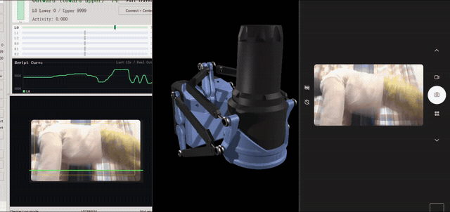
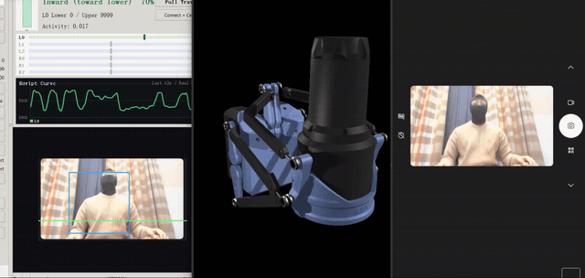
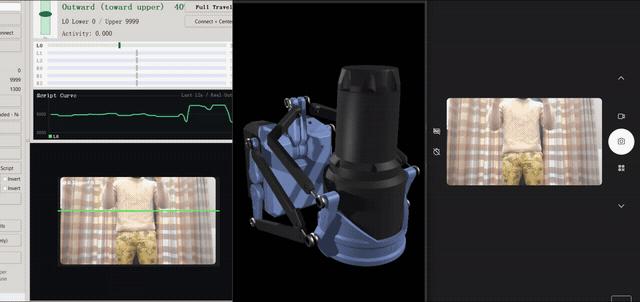
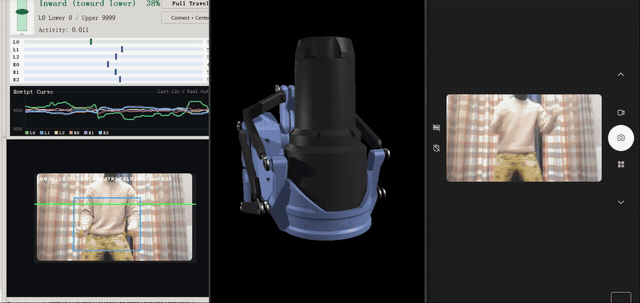
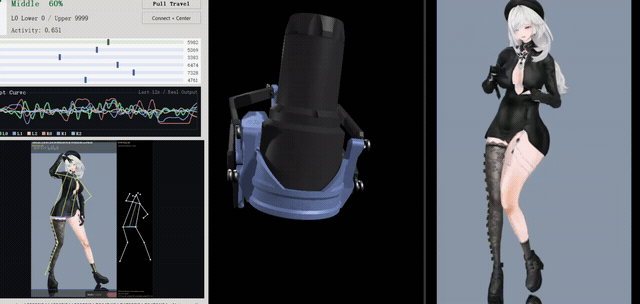
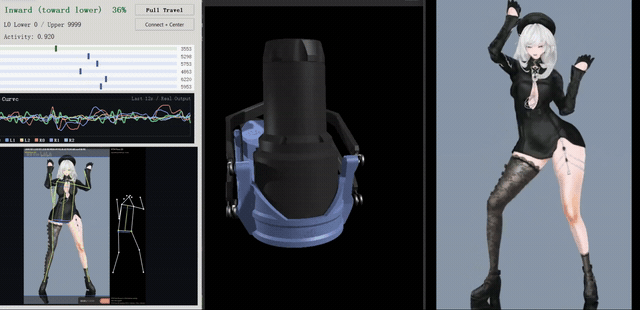

# SR6/OSR6 Realtime Screen TCode High Hardware Compatibility

**SR6/OSR6 Realtime Screen TCode High Hardware Compatibility** is a Windows app that reads a selected screen region in realtime, converts visible motion into TCode, and outputs it to OSR/SR6/OSR6-compatible devices through USB serial or BLE. It can also preview output without hardware and record/export `.funscript`.

> **Adults only. This project is intended for adults. Minors are prohibited.**
>
> **Important six-axis warning:** Six Axis mode is only recommended when lighting is good, the main subject is clear, and the selected screen region is clean. If the image is unclear, crowded, dark, or unstable, start with `L0 Only` or `Log only` preview.

Current test version: `2.0.0-test.3`

> **BETA / prerelease, not stable 2.0.0.** New hardware and GPU features are experimental. Start with `Log only`, then narrow limits and low intensity. Keep emergency stop accessible.

This source test adds device selection and an Intiface output adapter for supported commercial hardware. Read the [2.0 device compatibility guide](docs/Device_Compatibility_2.0.md) for setup and limitations. Autoblow is explicitly pending. New integrations are not yet hardware-tested. SR6/OSR6 names the same device across platforms in this project.

## Experimental Hardware Compatibility

**Compatibility does not guarantee good motion quality.** These new adapters are protocol/simulator-tested, not certified against physical devices. Exact model, firmware, connection stability and available functions determine whether they work.

| Hardware / Family | Current scope |
| --- | --- |
| OSR / SR6/OSR6 | Original TCode serial/BLE path retained |
| OSSM | TCode-compatible firmware only; stock firmware is not guaranteed |
| The Handy | Intiface-detected position functions |
| Lovense; Kiiroo / FeelTechnology | Supported functions reported by Intiface, not all products |
| Vorze; We-Vibe; Satisfyer; MysteryVibe; Motorbunny | Experimental Intiface routing, depending on detected model/functions |
| Custom (Intiface) | Second device option: bind L0, L1, L2, R0, R1 and R2 to functions of one selected device |
| Autoblow | Pending; output is **not enabled** |

Custom bindings start unbound. A function cannot be driven by two axes. Saved bindings return only after you manually select a matching device with the same capabilities and server address. Position follows limited axis position; speed/intensity follows axis motion speed. The default additional speed/level cap is 20%. Custom mode is not a universal private-protocol adapter. See [setup and safety limits](docs/Device_Compatibility_2.0.md).

`Log only` hides serial and BLE fields and does not open hardware. Measurement and axis limits expand on first use and after Restore Defaults; your later collapse choice is saved.

### Optional GPU Runtime

GPU acceleration is off by default. In the main RTM panel or realtime-start dialog, enable it and choose **CUDA (NVIDIA)** or **ONNX + DirectML (AMD / NVIDIA / Intel)**. Both RTM Pose 2D and 3D use the selected backend; Hybrid Analysis is unchanged. DirectML needs a DirectX 12 GPU and compatible Windows/driver, not CUDA. It currently uses the default GPU (adapter 0); model/operator support and performance vary. [DirectML requirements](https://onnxruntime.ai/docs/execution-providers/DirectML-ExecutionProvider.html).

Detection runs actual inference in a background child process. CUDA checks now distinguish CPU-only ONNX Runtime from missing cuDNN and GPU loading failures, and search existing CUDA/cuDNN DLL locations. Installing CUDA alone does not turn a CPU-only ONNX Runtime into a GPU engine. **Check GPU Again** refreshes the result. [CUDA compatibility](https://onnxruntime.ai/docs/execution-providers/CUDA-ExecutionProvider.html#requirements).

The install button downloads the selected runtime from PyPI into this test's private user folder. It displays dependency resolution, size checking, real download percentage/MB/component, extraction/installation, and inference verification. An unknown download size is shown explicitly, not as a guessed percentage; download 100% does not mean installation is finished. Wheels are SHA-256 verified before offline installation. CUDA downloads may exceed 1 GB; allow at least 5 GB free space. Drivers and the formal Python environment remain untouched. Failed installs do not replace an existing runtime.

CUDA and DirectML have separate runtime folders. **Restart using `Start.cmd` after installation or when prompted after switching backends**; this also applies when choosing a backend in the start dialog. GPU inference failures fall back to CPU. Both the portable exe and source build support in-app installation. The portable exe does not require a separate Python installation.

**CUDA: larger runtime. DirectML: smaller runtime.** These labels describe download size, not guaranteed model accuracy. Packages include CPU inference dependencies and installer tooling, but **no pose models, CUDA/cuDNN, NVIDIA runtime wheels or DirectML binaries**. Download optional models/runtimes from inside the app. This prerelease does not replace 1.1.2.

All dropdowns now expand to the width of their full option text. Names wider than a monitor remain accessible with horizontal scrolling. The realtime-start dialog scrolls vertically and keeps its action buttons visible.

## Analysis Demos

### Hybrid Analysis L0

Available since v1.0.0. Test hardware: CPU Intel Ultra 9; GPU disabled / not used for this analysis.

Hybrid Analysis L0 focuses on the main linear axis. It reads the selected screen region, tracks the dominant motion rhythm, and outputs limited four-digit L0 TCode.

### Hybrid Analysis Six-Axis

Available since v1.0.0. Test hardware: CPU Intel Ultra 9; GPU disabled / not used for this analysis.

Six-Axis Hybrid Analysis expands the realtime screen analysis across L0, L1, L2, R0, R1, and R2 for richer OSR6-style motion output.

### RTM Pose 2D GPU Acceleration

Available since v1.1.2. Test hardware: CPU Intel Ultra 9; GPU NVIDIA GeForce RTX 4090 Laptop GPU; RTM GPU acceleration enabled.

RTM Pose 2D uses a local ONNX pose model for pose-driven analysis. With GPU acceleration enabled, pose inference can run on the 4090 Laptop GPU.

### RTM Pose 2D CPU Mode

Available since v1.1.2. Test hardware: CPU Intel Ultra 9; GPU disabled / no GPU acceleration.

RTM Pose 2D can also run without GPU acceleration. This mode keeps inference on the Intel Ultra 9 CPU for comparison and fallback testing.

Dance source used in the RTM Pose demos: [Bilibili BV1UvtE6uEkD](https://www.bilibili.com/video/BV1UvtE6uEkD/). For infringement concerns, contact aivnailedeng@gmail.com for removal.

## Download

- [BETA release and Windows / Source ZIP downloads](https://github.com/LexZeon/osr-screen-tcode/releases/tag/v2.0.0-test.3).
- Windows ZIP: extract the **entire folder**, then double-click `Start.cmd` or the exe. Do not run inside the ZIP or move the exe away from `_internal`.
- Source folder: run `Start.cmd` directly from the cloned repository.
- English quick start: [Quick_Start.md](docs/Quick_Start.md)
- Chinese quick start: [简易教程.md](docs/简易教程.md)
- Full English manual: [User_Manual_EN.md](docs/User_Manual_EN.md)
- Full Chinese manual: [用户使用手册.md](docs/用户使用手册.md)
- AI prompting guide for continued development: `AI_Prompting_Guide.md`

This test uses separate settings and does not replace the 1.1.2 release.

## Run From Source

After cloning the repository on Windows, double-click `Start.cmd` or `Start-Source.cmd`. It uses an available runtime or creates a local `.venv` and installs missing dependencies. Python 3.10+ is required when no compatible runtime is available. It never installs packages into the sibling formal repository's environment.

## Main Features

- Realtime screen-region capture and motion analysis.
- USB serial and BLE UART output for TCode-compatible devices.
- `L0 Only` and `Six Axis` output modes.
- Hybrid Analysis mode for low-latency non-dance screen reading.
- RTM Pose 2D/3D dance modes with local ONNX models.
- RTM Pose optical-flow assist and Kalman fusion are enabled by default for smoother keypoint tracking.
- Optional CUDA or DirectML RTM Pose acceleration, disabled by default, with CPU fallback.
- Audio-only mode for rhythm-driven use.
- Per-axis limits, total travel scaling, presets, smoothing, speed limit, dead zone, gating, and other comfort controls.
- Measurement mode for saving safe upper/lower limits locally.
- Limited-axis curve and SR6/OSR6 reference preview. Other devices show an explicit shape-mismatch notice; this is not hardware position feedback.
- Local settings persistence across launches.

## Works With USB Screen Stream

This tool can be used together with [usb-screen-stream](https://github.com/LexZeon/usb-screen-stream). For example, use usb-screen-stream to mirror a USB-connected phone or other device screen to the PC, then select that streamed window or region in SR6/OSR6 Realtime Screen TCode High Hardware Compatibility for realtime TCode output.

## First Use

For native TCode hardware, read [Quick Start](docs/Quick_Start.md) and use Measurement Mode to save safe upper/lower limits. New Intiface devices use the separate [compatibility guide](docs/Device_Compatibility_2.0.md), not the SR6/OSR6 sweep tests. Settings are saved locally; do not restore defaults on every launch.

For preview without hardware, set output to `Log only`, click `Show Preview`, then start realtime output and select the screen region. The app will show the curve and preview without driving a device.

## Privacy

This is a local desktop tool. Screen capture and analysis run locally on your computer. The app does not upload your screen frames.

## AI/Vibe Coding Note

This project was built with AI-assisted vibe coding. It is shared directly as a practical SR6/OSR6 realtime screen-to-TCode tool, with rough edges expected and improvements welcome.

## Acknowledgements

This project learned from public open-source work around OSR/TCode tooling, realtime visual analysis, funscript generation, and simulator-style preview ideas, including projects such as FunGen, PoseFunscripter, and nb-3d-simulator. Please contact the maintainer if an acknowledgement or license notice should be corrected.

Special thanks to **DK** and **机械纪元** for technical guidance.

Thanks to **“电话机”** for volunteering to test the software and providing suggestions.

## Contact

For infringement concerns, license corrections, suggestions, or collaboration: aivnailedeng@gmail.com

---

# SR6/OSR6 Realtime Screen TCode High Hardware Compatibility（中文说明）

**SR6/OSR6 Realtime Screen TCode High Hardware Compatibility** 是一个 Windows 软件，可以实时读取你框选的屏幕区域，把画面运动转换成 TCode，并通过 USB 串口或 BLE 输出给 OSR/SR6/OSR6 兼容设备。也可以不连接设备先预览输出，或者录制/导出 `.funscript`。

> **成年人使用提示：本项目面向成年人使用，未成年禁止入内。**
>
> **六轴模式重要警告：六轴只建议在光线好、主体清晰、框选区域干净的画面里使用。** 画面太暗、主体不清楚、无关运动太多或画面不稳定时，请先使用 `L0 Only` 或 `Log only` 预览。

当前测试版本：`2.0.0-test.3`

> **BETA 预发布，不是 2.0.0 稳定版。** 新硬件与 GPU 功能仍属测试功能。请先用 `Log only` 预览，再用窄范围、低强度测试，确保可以随时急停。

本测试新增主界面设备选择和 Intiface 商业设备输出适配。请先阅读 [2.0 设备兼容说明](docs/Device_Compatibility_2.0.md)，其中列明接入方法与限制。Autoblow 当前仍待适配，新增商业设备尚未通过真机验证。本项目用 SR6/OSR6 并列表示同一设备在不同平台的名称。

## 新增硬件实验兼容

**兼容不代表效果一定好，也不保证同品牌所有型号都能使用。** 新增适配通过了模拟协议检查，尚未经实体设备验证；实际效果取决于型号、固件、连接稳定性和可用功能。

| 硬件 / 品牌 | 当前适配范围 |
| --- | --- |
| OSR / SR6/OSR6 | 保留原有 TCode 串口/BLE 输出 |
| OSSM | 仅支持兼容 TCode 的固件，不保证原厂固件 |
| The Handy | 尝试控制 Intiface 识别出的位置功能 |
| Lovense、Kiiroo / FeelTechnology | 尝试控制 Intiface 返回的可用功能，不代表全系列 |
| Vorze、We-Vibe、Satisfyer、MysteryVibe、Motorbunny | 通过 Intiface 实验适配，具体以扫描到的型号及功能为准 |
| 自定义（Intiface） | 设备类型第二项：把 L0、L1、L2、R0、R1、R2 分别绑定到选定设备的交互功能 |
| Autoblow | 仍待适配，**没有开放输出** |

自定义默认全部“不绑定”，同一个设备功能不能重复绑定多个轴。手动选择相同设备、且功能和服务地址均匹配后，才恢复已保存的绑定。位置功能跟随受限轴位置；速度/强度功能跟随轴运动速度，额外上限默认 20%。自定义不等于兼容任意私有协议。详见[接入与安全说明](docs/Device_Compatibility_2.0.md)。

`Log only` 不显示串口或 BLE 设置，也不打开硬件连接。首次使用及恢复所有默认设置后，“测量模式和轴上下限”默认展开；之后手动收起的选择会保存。

### 可选 GPU 运行库安装

GPU 默认关闭。主界面 RTM 设置和开始实时输出弹窗中，勾选后可选择 **CUDA（NVIDIA）** 或 **ONNX + DirectML（AMD / NVIDIA / Intel）**，同时适用于 RTM Pose 2D、3D，不改变混合分析。DirectML 不需要 CUDA，但需要支持 DirectX 12 的显卡、Windows 和驱动；当前使用系统默认显卡（适配器 0），支持情况及速度因模型、显卡而异。[DirectML 官方要求](https://onnxruntime.ai/docs/execution-providers/DirectML-ExecutionProvider.html)。

检测在后台子进程进行真实推理验证。CUDA 提示区分“CPU 版 ONNX Runtime”“cuDNN 缺失”“GPU 加载失败”，并查找已有 CUDA/cuDNN 的 DLL 目录。只装 CUDA 并不能让 CPU 版 ONNX Runtime 变成 GPU 版。可点“重新检测 GPU”刷新结果。[CUDA 兼容说明](https://onnxruntime.ai/docs/execution-providers/CUDA-ExecutionProvider.html#requirements)。

一键安装会把所选运行库从 PyPI 下载到本测试版用户目录，依次显示：解析兼容组件、获取大小、真实下载百分比/MB/组件名称、解压安装、推理验证。无法取得总大小时会明确说明，不编造百分比；下载 100% 不等于安装完成。下载文件通过 SHA-256 校验后离线安装。CUDA 下载可能超过 1 GB，请预留至少 5 GB 空间。不会修改系统显卡驱动或正式版 Python 环境；失败不会替换原环境。

CUDA 与 DirectML 分目录保存。**安装完成或切换后提示需要重启时，请关闭软件，再双击 `Start.cmd`**；弹窗选择的 GPU 后端也是全局偏好。实际 GPU 推理失败时回退 CPU。免安装 exe 和源码版均支持软件内安装；免安装版不需要另外安装 Python。

**CUDA：运行库较大。DirectML：运行库较小。** 这是下载体积提示，不表示同一模型的准确率一定有高低。发布包包含 CPU 推理依赖与安装工具，但**不含姿态模型、CUDA/cuDNN、NVIDIA 可选运行库或 DirectML 二进制文件**，需要时在软件内下载。本预发布不替换 1.1.2 正式版。

所有下拉列表展开时按完整选项文字加宽；超过显示器宽度的名称可以水平滚动查看。开始输出弹窗支持纵向滚动，底部操作按钮保持可见。

## 分析演示

### Hybrid Analysis L0

v1.0.0 起支持。测试硬件：CPU Intel Ultra 9；GPU 关闭 / 此分析未使用 GPU。

Hybrid Analysis L0 聚焦主线性轴。它会读取框选屏幕区域，跟踪主要运动节奏，并输出限制后的四位 L0 TCode。

### Hybrid Analysis Six-Axis

v1.0.0 起支持。测试硬件：CPU Intel Ultra 9；GPU 关闭 / 此分析未使用 GPU。

Hybrid Analysis Six-Axis 会把实时画面分析扩展到 L0、L1、L2、R0、R1、R2，用于更丰富的 SR6/OSR6 六轴输出。

### RTM Pose 2D GPU 加速

v1.1.2 起支持。测试硬件：CPU Intel Ultra 9；GPU NVIDIA GeForce RTX 4090 Laptop GPU；已开启 RTM GPU 加速。

RTM Pose 2D 使用本地 ONNX 姿态模型做姿态驱动分析。开启 GPU 加速后，姿态推理可以运行在 4090 Laptop GPU 上。

### RTM Pose 2D CPU 模式

v1.1.2 起支持。测试硬件：CPU Intel Ultra 9；GPU 关闭 / 未开启 GPU 加速。

RTM Pose 2D 也可以不启用 GPU 加速，推理会运行在 Intel Ultra 9 CPU 上，适合做对照测试或作为兼容回退。

RTM Pose 演示中的舞蹈素材来源：[Bilibili BV1UvtE6uEkD](https://www.bilibili.com/video/BV1UvtE6uEkD/)。如有侵权请联系 aivnailedeng@gmail.com 删除。

## 下载

- [BETA 发布页与 Windows / Source ZIP 下载](https://github.com/LexZeon/osr-screen-tcode/releases/tag/v2.0.0-test.3)。
- Windows ZIP：先**完整解压**，再双击 `Start.cmd` 或 exe；不要在压缩包内直接运行，也不要把 exe 单独移出 `_internal` 所在目录。
- 源码目录：clone 仓库后直接运行 `Start.cmd`。
- 英文简易教程：[Quick_Start.md](docs/Quick_Start.md)
- 中文简易教程：[简易教程.md](docs/简易教程.md)
- 英文完整手册：[User_Manual_EN.md](docs/User_Manual_EN.md)
- 中文完整手册：[用户使用手册.md](docs/用户使用手册.md)
- 后续 AI 开发提示词指南：`AI_Prompting_Guide.md`

本测试使用独立设置，不替换 1.1.2 正式版。

## 从源码运行

在 Windows 上 clone 仓库后，双击 `Start.cmd` 或 `Start-Source.cmd`。它会优先使用可用运行环境，否则创建本地 `.venv` 并安装依赖。没有可用环境时需要 Python 3.10+；不会向相邻正式仓库的运行环境安装或升级依赖。

## 主要功能

- 实时框选屏幕区域并分析画面运动。
- 通过 USB 串口或 BLE UART 输出 TCode。
- 支持 `L0 Only` 和 `Six Axis`。
- Hybrid Analysis 模式用于低延迟非舞蹈读屏分析。
- RTM Pose 2D/3D 舞蹈分析模式，使用本地 ONNX 模型。
- RTM Pose 默认开启关键点光流辅助和卡尔曼融合，让骨架追踪更平滑。
- RTM Pose 可选 CUDA 或 DirectML GPU 加速，默认关闭，失败时回退 CPU。
- 支持只监听声音的节奏模式。
- 支持每轴上下限、总行程倍率、预设、平滑、限速、死区、活动门控等调试项。
- 测量模式可以手动遥控并保存本地安全上限/下限。
- 可查看实时脚本曲线和基于最终限制后输出的 3D 预览。
- 所有主要设置会保存到本地，下次打开继续使用。

## 可联动 USB Screen Stream

本工具也可以和 [usb-screen-stream](https://github.com/LexZeon/usb-screen-stream) 搭配使用。比如先用 usb-screen-stream 把 USB 连接的手机或其他设备画面投到电脑上，再在本工具里框选该窗口或区域进行实时 TCode 输出。

## 第一次使用

原生 TCode 设备请先看[简易教程](docs/简易教程.md)，使用测量模式保存安全上下限。新增 Intiface 设备请按[兼容说明](docs/Device_Compatibility_2.0.md)接入，不要套用 SR6/OSR6 扫幅测试。设置会本地保存，不必每次恢复默认。

没有设备想先预览，可以把输出设为 `Log only`，点击 `Show Preview`，再开始实时输出并框选屏幕区域。这样只显示曲线和预览，不会驱动机器。

## 隐私

这是本地桌面工具。屏幕捕获和分析都在你的电脑本地运行，软件不会上传画面。

## AI / Vibe Coding 声明

本项目是 AI 辅助 vibe coding 做出来的实用工具。欢迎改进，也欢迎反馈问题。

## 鸣谢

本项目参考和学习了公开开源社区里 OSR/TCode、实时视觉分析、funscript 生成和模拟预览相关思路，包括 FunGen、PoseFunscripter、nb-3d-simulator 等项目。如有鸣谢或许可证信息需要修正，请联系维护者。

特别感谢 **DK** 和 **机械纪元** 提供技术指导。

感谢 **“电话机”** 参与志愿测试并提供建议。

## 联系

侵权、许可证修正、建议或合作请联系：aivnailedeng@gmail.com
