# Quick Start

**Adults only: this project is intended for adults. Minors are prohibited.**

**IMPORTANT SIX-AXIS WARNING:** Six-axis mode is only recommended when the video/screen has good lighting, a clear main subject, and a clean selected region. If the picture is unclear, start with L0 mode or Log only preview first.

Before your first real session, use Measurement Mode to save safe upper/lower limits for your own device and comfort range. These limits are saved locally on this computer. If output works normally next time, do not restore defaults again unless you intentionally want to reset everything.

Tip: hover your mouse over buttons, sliders, and parameter names in the app. Small tooltips explain what each item does.

## Download

For the Windows package, extract the whole folder first, then run `OSR6-Realtime-Screen.exe` or `Start.cmd`.

For source code users, clone the repository and double-click `Start.cmd` or `Start-Source.cmd`.

## With An OSR6 Device

1. Double-click `OSR6-Realtime-Screen.exe`, or double-click `Start.cmd`.

2. Read the adults-only warning and continue only if you are 18+.

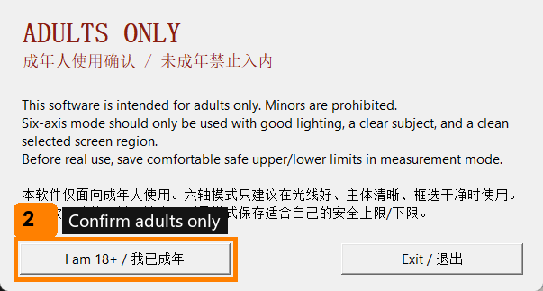

3. Choose `English` in the language popup.

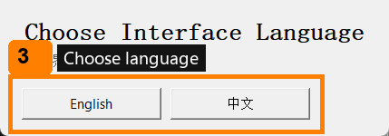

4. On first run, click `Restore Defaults` once and confirm.

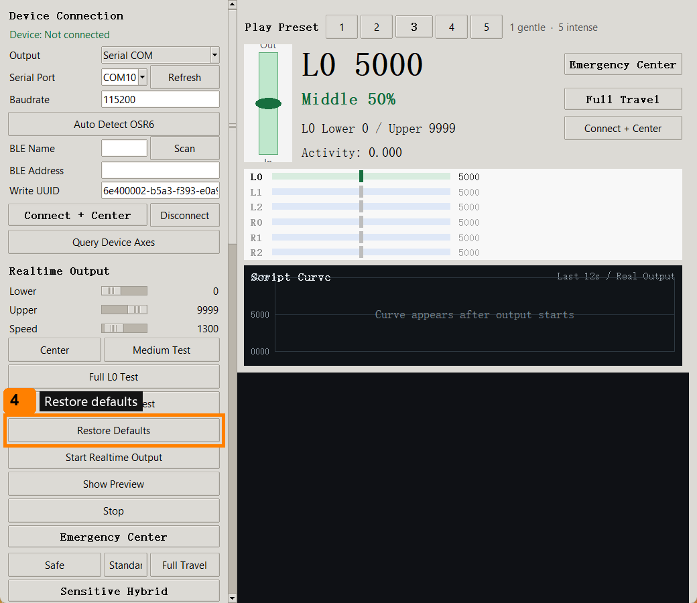

5. In the left device panel, choose USB serial or BLE.

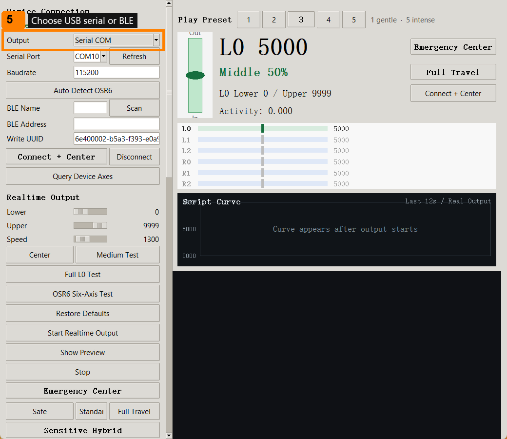

6. Click `Connect + Center` and confirm the app shows a connected status.

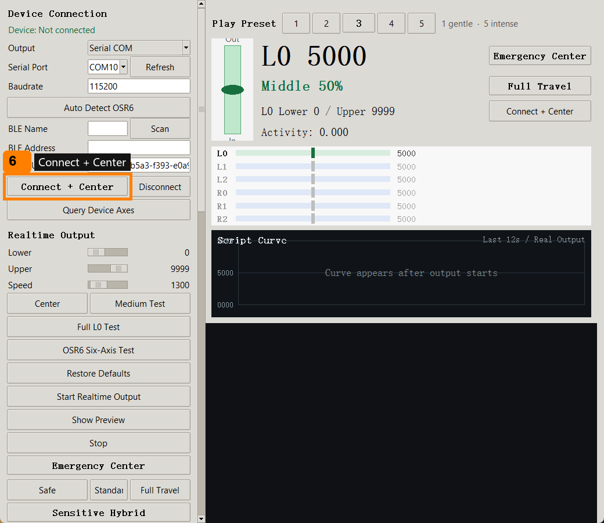

7. Use Measurement Mode to move L0 manually.

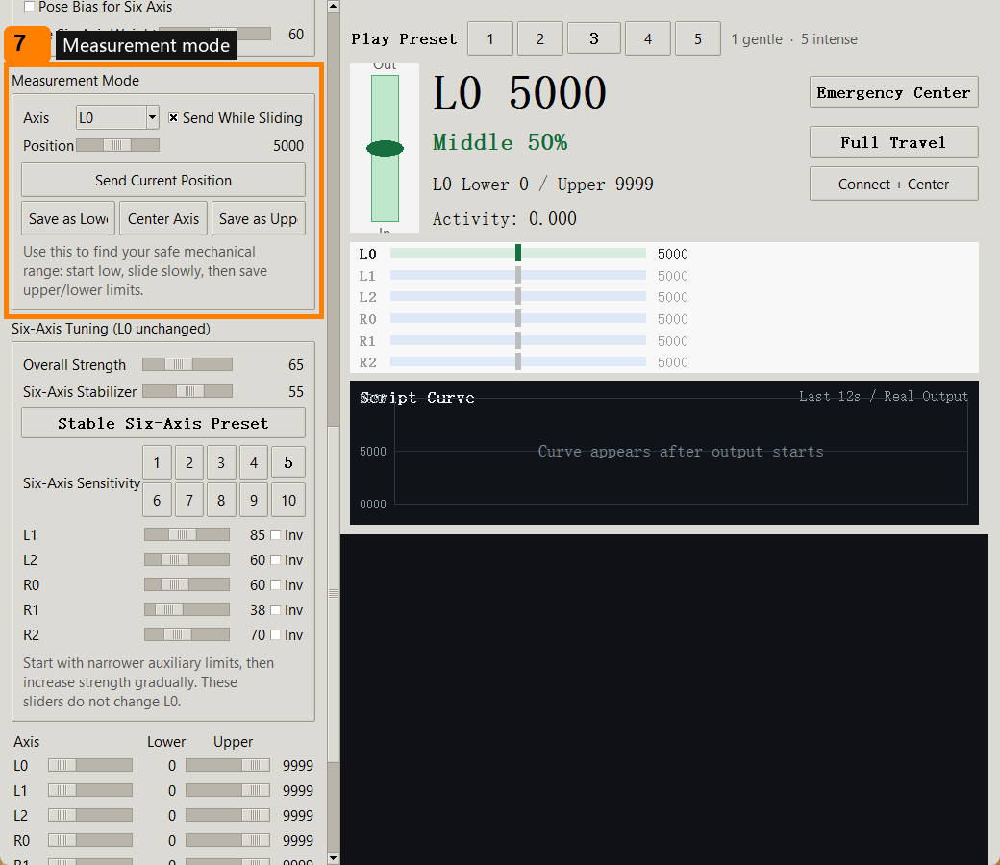

8. Save a comfortable safe upper limit and lower limit.

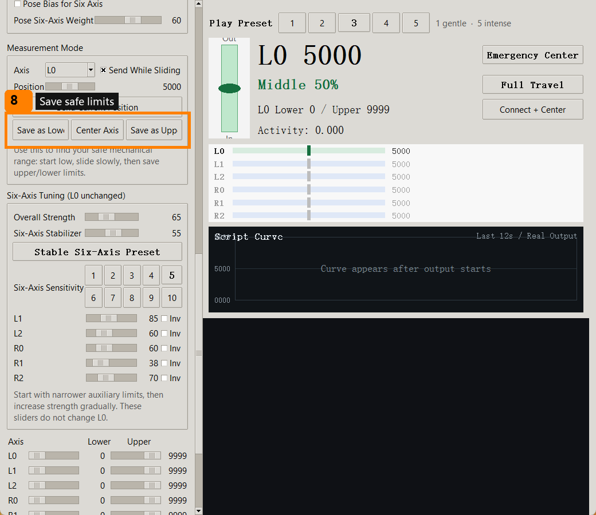

9. Start with play preset `3`.

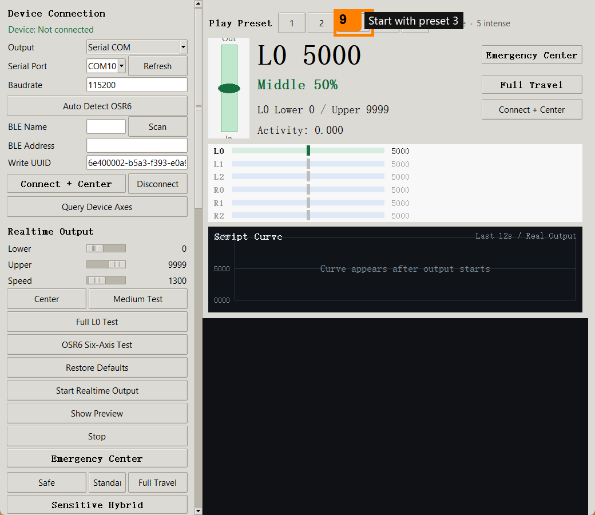

10. Click `Start Realtime Output`.

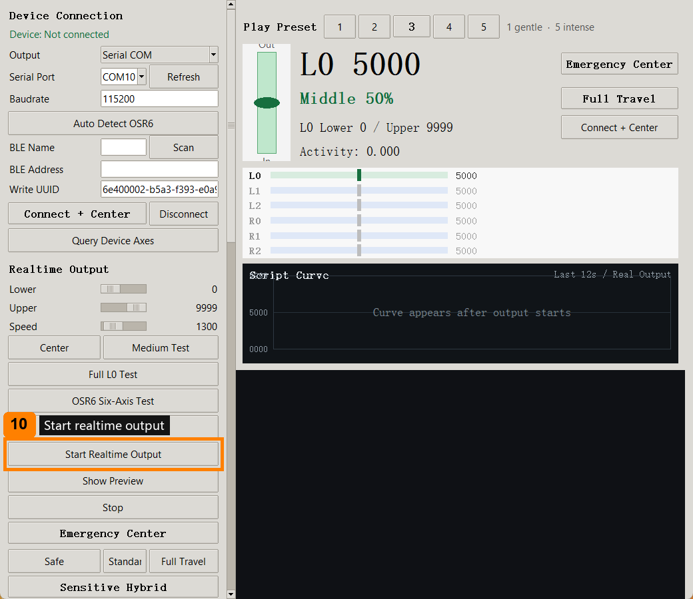

11. In the confirmation popup, choose `L0 Only` first. Try `Six Axis` only when the picture is clear and stable.

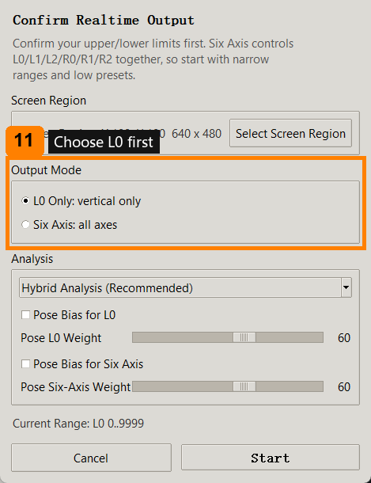

12. Confirm or select the screen region, then use `Hybrid Analysis (Recommended - Non-Dance)` first.

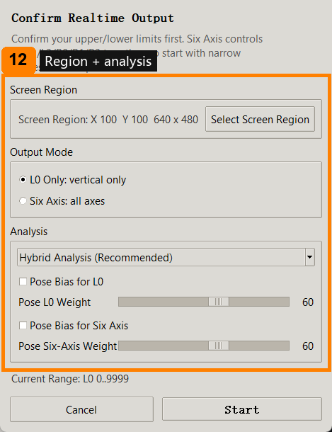

13. Click `Start`. Increase intensity only after output feels stable.

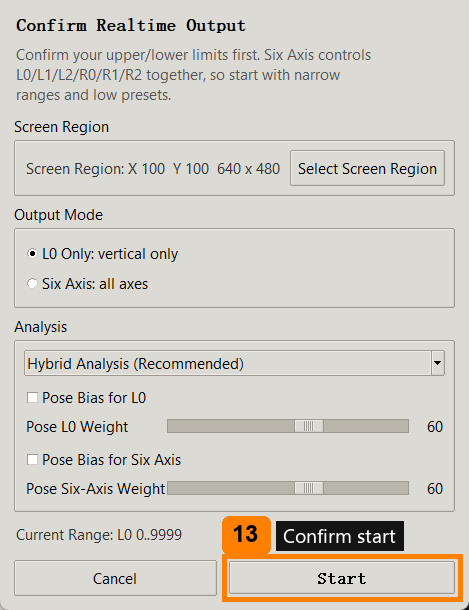

Your limits and settings are saved locally. If output works normally next time, do not restore defaults again.

## Preview Without A Device

You can try the interface without an OSR6 device. This is the safest first look.

1. Open the app, confirm adult use, and choose English.
2. Set output to `Log only`.
3. Click `Show Preview`.
4. Open any moving video or page on the screen.
5. Click `Start Realtime Output`.
6. In the popup, choose `L0 Only`.
7. Select the moving screen region.
8. Watch the curve and preview. The app will show what it would output, but it will not drive hardware in Log only mode.

For a full explanation of every panel and parameter, read `User_Manual_EN.md`.

## Contact

For infringement concerns, license corrections, suggestions, or collaboration: aivnailedeng@gmail.com

Discord community: https://discord.gg/E7RY3rdKw

Discord note: if you join the community, follow the adults-only restriction. The server/relevant channels should be configured as age-restricted so minors cannot access adult content.
