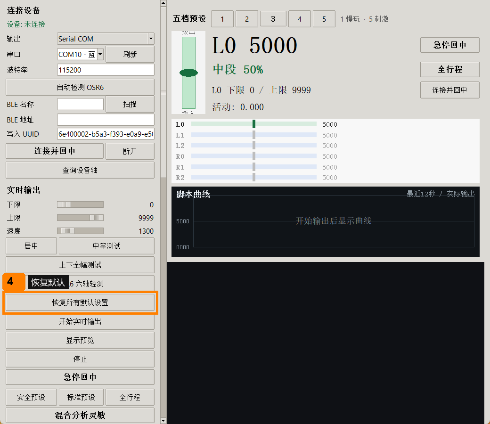
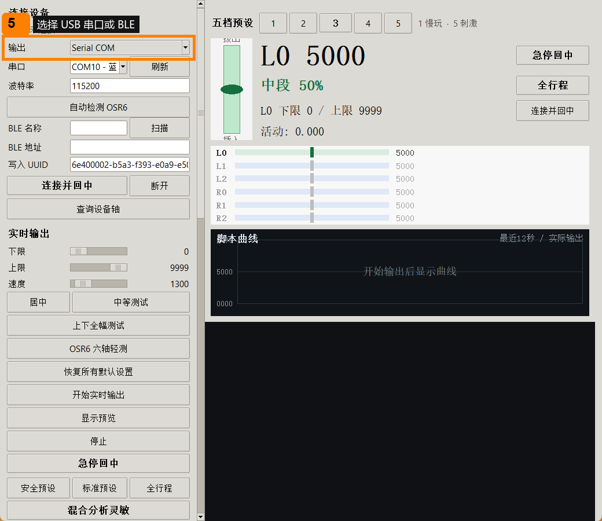
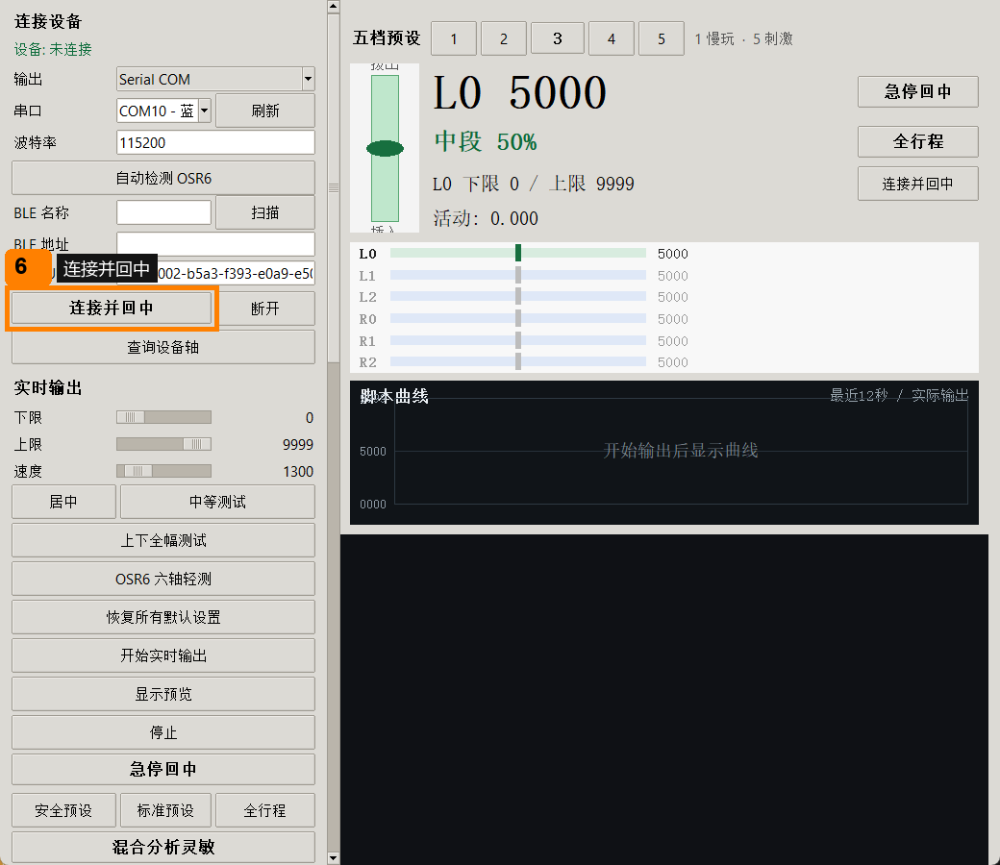
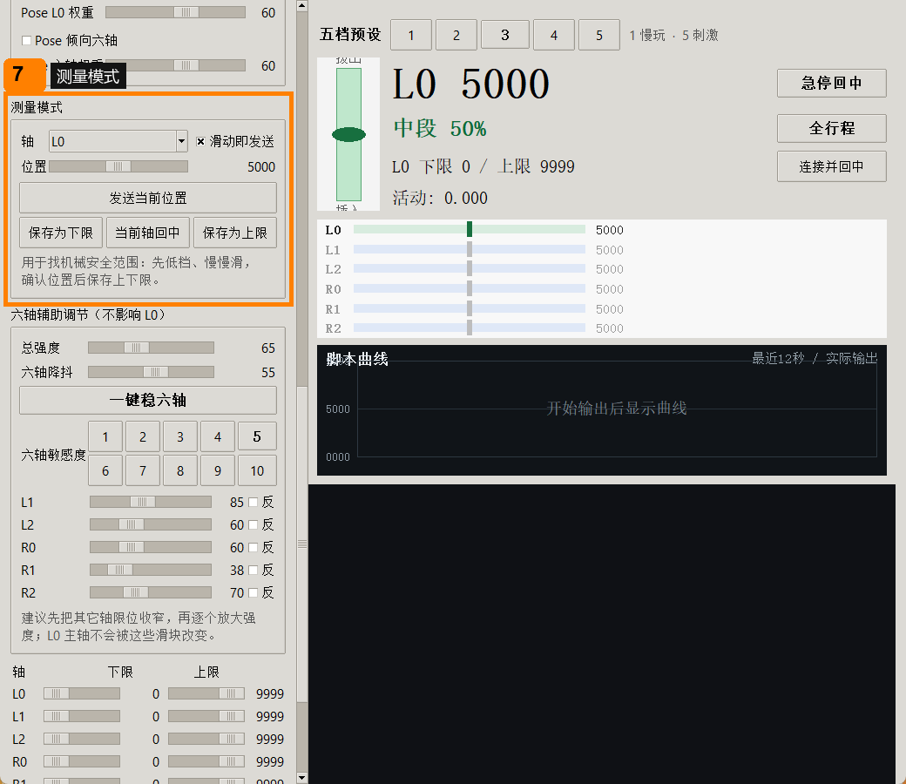
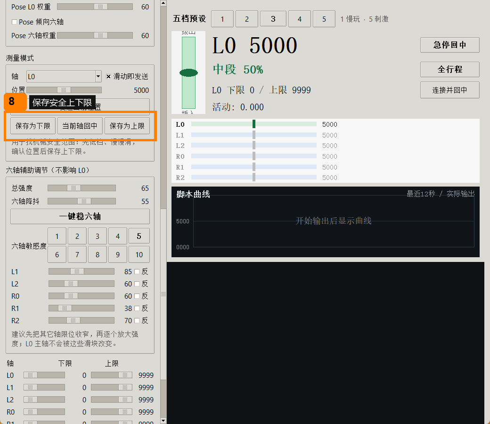
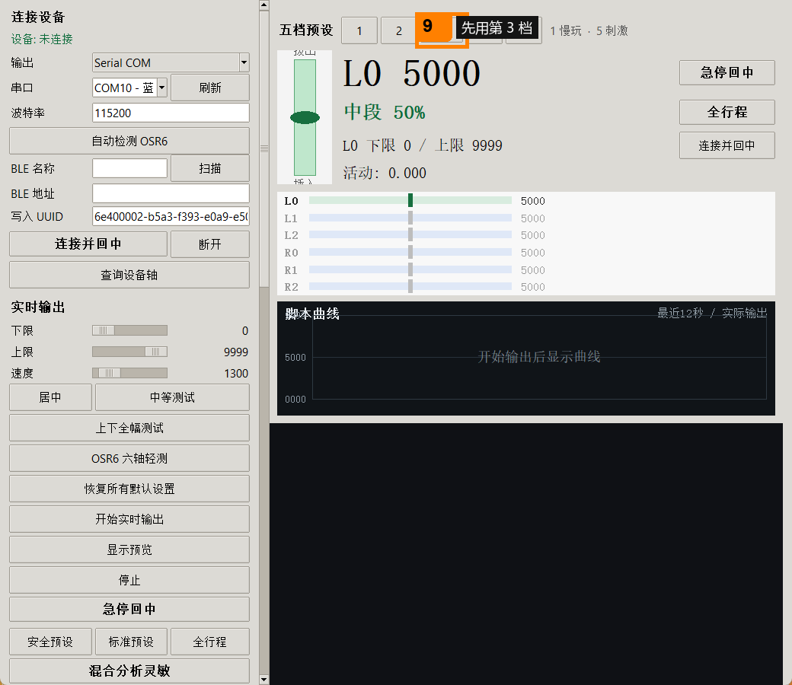
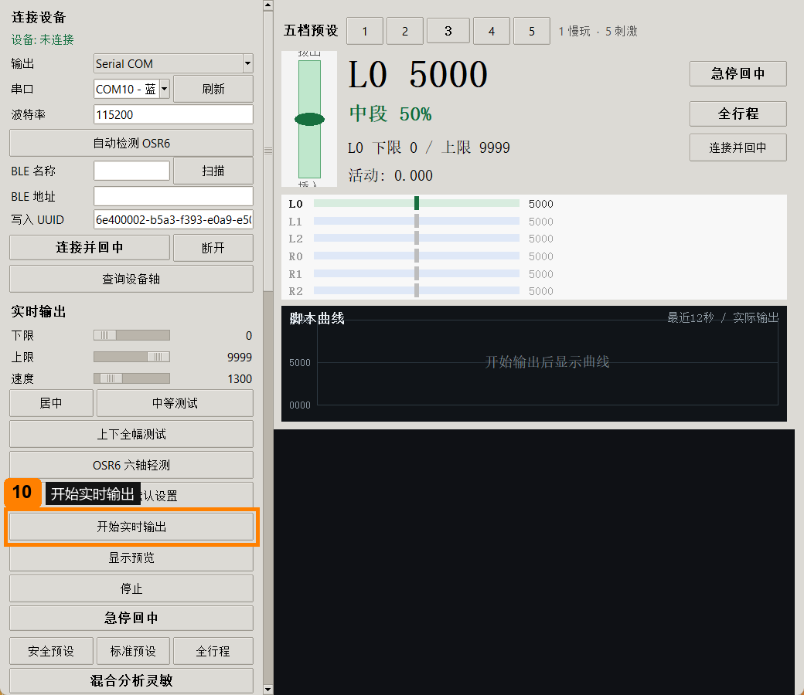
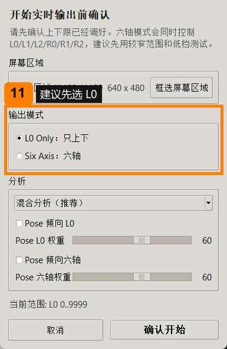
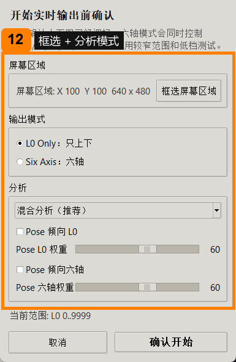
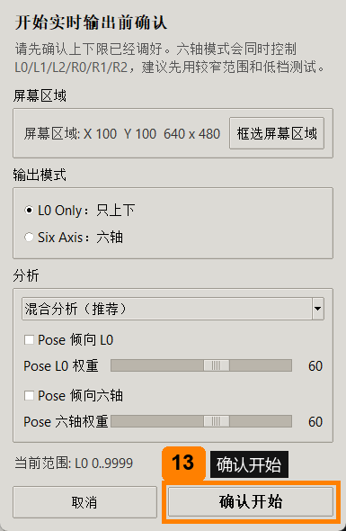

# 简易教程

**成年人使用提示：本项目面向成年人使用，未成年禁止入内。**

**重要警告：六轴模式只建议在光线好、主体清晰、框选区域干净的画面里使用。** 如果画面不清楚，请先用 L0 模式或 Log only 预览。

第一次正式使用前，建议先用“测量模式”保存适合你自己设备和体感的上限/下限。上下限会保存到本地电脑。下次打开如果能正常输出脚本，就不用再点“恢复所有默认设置”，除非你想全部重置。

提示：鼠标光标悬浮在按钮、滑块、参数名上，会出现小字解释，告诉你这个功能是干嘛的。

## 下载

下载 `OSR6-Realtime-Screen-v1.0.2-Windows.zip`，先完整解压，再从解压后的文件夹里运行。不要直接在压缩包预览窗口里双击 exe。

如果是源码用户，clone 仓库后双击 `Start.cmd` 或 `Start-Source.cmd`。

## 有 OSR6 设备时

1. 优先双击 `OSR6-Realtime-Screen.exe`，或双击 `Start.cmd`。

2. 先阅读成年人警告；只有确认自己已成年才继续。

3. 在语言弹窗里选择 `中文`。

4. 第一次打开，先点“恢复所有默认设置”，确认一次。

5. 在左侧连接区域选择 USB 串口或 BLE。

6. 点“连接并回中”，确认软件显示已连接。

7. 点“测量模式”，用滑块遥控 L0 上下移动。

8. 保存一个舒服、安全的上限和下限。

9. 先用第 `3` 档。

10. 点“开始实时输出”。

11. 弹窗里建议先选 `L0 Only`；六轴只在光线好、主体清晰、框选干净时再开。

12. 确认或重新框选屏幕区域，并优先使用“混合分析（推荐）”。

13. 点“确认开始”。稳定后再慢慢加刺激度。

上下限和设置会保存到本地。下次如果能正常输出脚本，就不用再点“恢复所有默认设置”。

## 没有机器也想先看预览

可以先不连接设备，安全看一下软件会怎么分析画面。

1. 打开软件，确认成年人提示，并选择中文。
2. 输出选择 `Log only`。
3. 点“显示预览”。
4. 屏幕上打开一个有运动的视频或网页。
5. 点“开始实时输出”。
6. 弹窗里先选择 `L0 Only`。
7. 框选正在动的画面区域。
8. 看曲线和预览变化。Log only 模式只显示输出，不会控制硬件。

想看所有面板和参数的详细说明，请读 `用户使用手册.md`。英文版是 `User_Manual_EN.md`。

## 联系

侵权、许可证修正、建议、合作反馈请联系：aivnailedeng@gmail.com

Discord 交流：https://discord.gg/E7RY3rdKw

Discord 提醒：如果进入交流群，请遵守成年人限制。服务器/相关频道建议设置为年龄受限，未成年禁止进入或查看相关内容。
